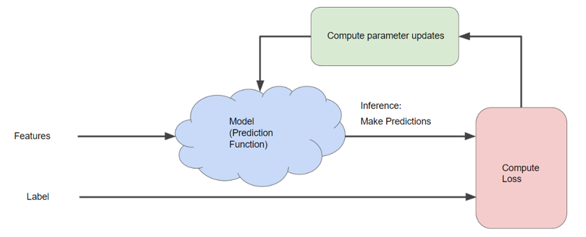
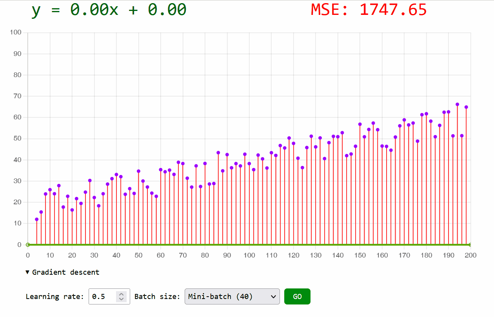
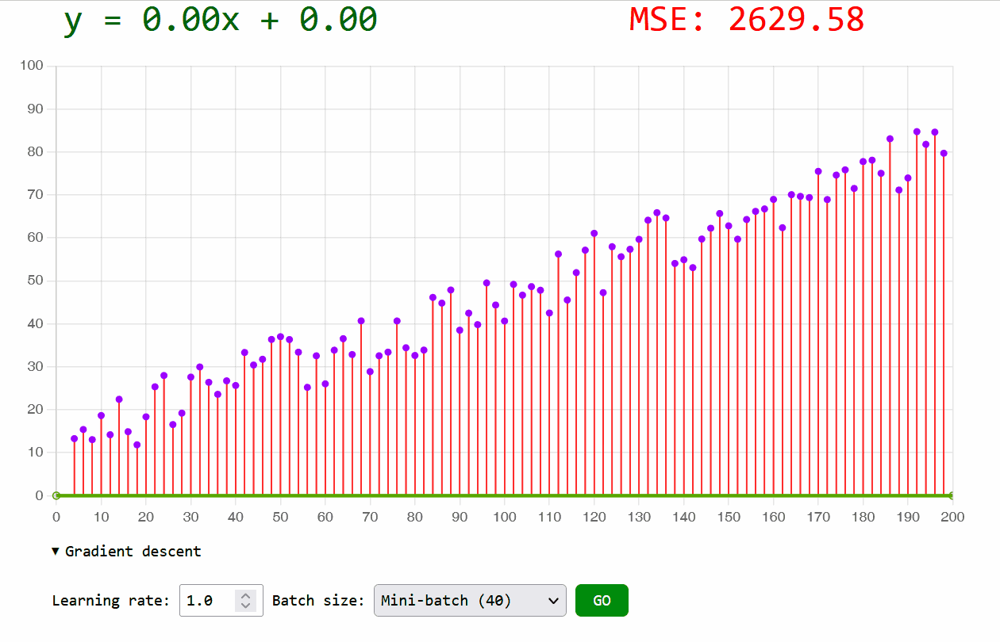
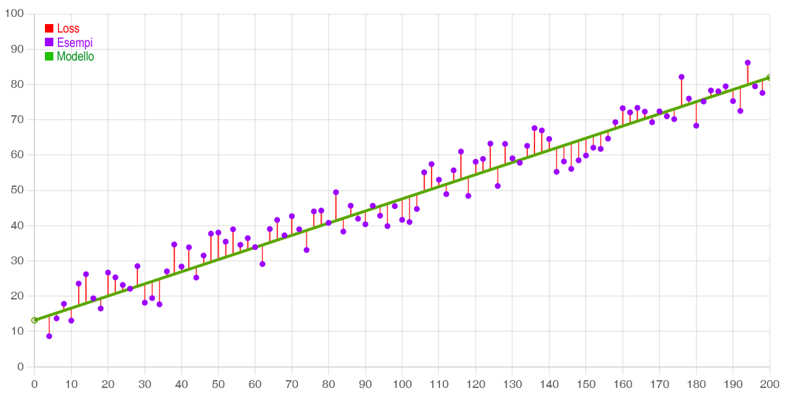
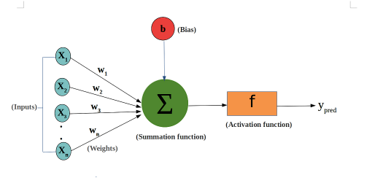
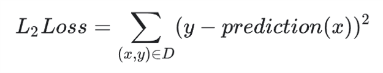
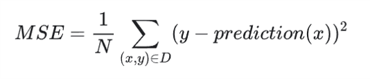

# Riassunto

Dato che il corso è abbastanza sintetico, almeno per quel che riguarda gli algoritmi che sono alla base dell'apprendimento dei modelli, ne abbiamo approfittato per approfondire alcuni temi:

### Cosa avviene a ogni iterazione del gradient descent?
I parametri `w` e `b` del modello `y = wx + b` vengono modificati leggermente in modo che il *Loss* si riduca. Poi si passa all'iterazione successiva e il ciclo ricomincia finché il gradient descent non *converge*.



C'è un esempio di codice JavaScript nei file HTML situati nella presente cartella del repository. Vedi la funzione `learn`.
[gradient-descent-classification.html](gradient-descent-classification.html#L130)

> All'atto pratico, vengono fatte le derivate parziali per `w` e `b` della funzione MSE (mean squared error) che abbiamo usato per calcolare il *Loss*. La derivata è lo strumento matematico che viene usato per determinare se i parametri debbano crescere o diminuire a ogni iterazione. Non è strettamente necessario conoscere il procedimento matematico perché TensorFlow (e altre librerie) si occupano per noi di calcolarle.
Ad ogni modo, ci sono informazioni qui: https://mccormickml.com/2014/03/04/gradient-descent-derivation/


### Quand'è che il gradient descent *converge*?
Quando siamo nei pressi del Loss minimo cioè quando, di iterazione in iterazione, il Loss diminuisce di un quantitativo talmente piccolo che non vale la pena continuare.

### Come far convergere  il gradient descent più velocemente?
Può capitare che ci metta davvero tanto a convergere (centinaia o migliaia di iterazioni). Quando questo succede soprattutto se abbiamo un dataset con milioni di righe o migliaia di colonne. Allora possiamo:
 - Scegliere un learning rate più grande, stando attenti che non sia troppo grande, altrimenti non arriveremmo mai al minimo (bisogna sperimentare);
 - Usare un mini-batch anziché l'intero dataset. Il gradient descent funziona anche se calcoliamo la loss su un sottinsieme di esempi (il numero esatto lo scegliamo noi: da qualche decina a poche migliaia - anche qui bisogna sperimentare). In questo modo faremo prima perché non sprecheremo troppa potenza computazionale.

> Esempio di gradient descent che converge abbastanza velocemente, dato che si è usato un mini-batch (il 20% del totale) e un learning rate sufficientemente grande:



> In questo esempio invece il gradient descent non converge mai perché si è scelto un learning rate troppo grande.



### Feature scaling
Il learning rate potrebbe non adattarsi bene a tutti i parametri. Ad esempio, potrebbe andar bene per *b* ma risultare troppo grande per *w*.

Affinché un learning rate si adatti bene a tutti i parametri, si preferisce scalare i valori di input (cioè le *x*) in modo che siano tutti normalizzati entro i valori 0 e 1. Ad esempio, se abbiamo temperature (-20°C ~ 100°C), pressioni (0.5atm ~ 3atm) e colori (R,G,B 0 ~ 255) che hanno range molto diversi tra loro, dovremo dividere i valori per un certo ammontare in modo che tutti ricadano tutti nel range 0 ~ 1. 
Ci sono informazioni qui sul come normalizzare l'input:

- https://towardsdatascience.com/gradient-descent-the-learning-rate-and-the-importance-of-feature-scaling-6c0b416596e1#585f
- https://www.robinwieruch.de/improving-gradient-descent-javascript/


# APPUNTI DEL CORSO

## Perché usare il machine learning?

- Si può ridurre il codice, perché se si realizza un modello si può evitare di scrivere algoritmi statici;
- Rendere migliori i prodotti software;
- Realizzare attività apparentemente "improgrammabili" (es. trascrivere il parlato).

C'è anche una ragione filosofica: ti cambia il modo in cui pensi a un problema. Anziché pensare subito a come codificare la soluzione, ti porta invece ad arrivare alla soluzione per gradi, attraverso esperimenti successivi.

## Terminologia

### Features (x)
Sono i dati che appartengono alla stessa riga nel dataset. Si indicano con 𝑥<sub>1</sub>, 𝑥<sub>2</sub>, ecc.. e vengono dati in pasto al modello.

L'indirizzo, le parole di un'email, le intestazioni, l'orario in cui è stata mandata, se contiene determinate locuzioni sono tutti esempi di features.

### Label (y)
È il risultato (es. spam o non spam) relativo alle features. Il modello dovrà essere addestrato confrontando le sue previsioni con le label del dataset.

### Previsione (y')
È il valore che il modello restituisce in output dopo aver processato le feature che riceve in input.

È anche chiamata *ipotesi*.

### Esempio
È una riga di dati nel dataset, cioè un insieme di feature. Un esempio può avere (o no) una label.

```
labeled example: {features, label}: (x, y)
unlabeled example: {features, ?}: (x, ?)
```

### Modello
Un modello è un qualsiasi costrutto matematico/informatico che riceve in input dei dati e produce un risultato. 
È composto da un insieme di parametri che gli permettono di calcolare il risultato.

### Training
Dai in pasto i dati labeled al modello che imparerà la correlazione tra feature e label, via via con più efficacia.

### Inference
Dopo aver fatto il training del modello, gli dai in pasto dati **unlabeled**, in modo che sia lui a fare le previsioni (y').

Un modello affidabile è in grado di fare previsioni realistiche e precise.

## Usi di un modello

### Regression
Serve a predire **valori continui**, es.
- il prezzo di vendita di una casa;
- la probabilità che un utente cliccherà un banner pubblicitario.

### Classification
Serve a predire **valori discreti** (classi), es.
- è spam o non spam (classificazione binaria)
- è la foto di un gatto, di un cane o di un criceto (classificazione multiclasse).

# Modello di regressione lineare
È una linea retta su un piano cartesiano, definita dalla funzione:

y = w<sub>1</sub>x<sub>1</sub> + b

Questa è anche chiamata **hypotesis function**. E si può scrivere anche come:

y = w<sub>1</sub>x<sub>1</sub> + w<sub>0</sub>

Oppure come:

y = θ<sub>1</sub>x<sub>1</sub> + θ<sub>0</sub>



- Gli *w* sono chiamati parametri o *weight*;
  - *b* in particolare è il *bias* o *intersect*, cioè il punto in cui interseca l'asse y. A volte è rappresentato come w<sub>0</sub> o θ<sub>0</sub>;
  - w<sub>1</sub> è lo *slope*, cioè la pendenza della retta;



## Calcolare e ridurre il costo

### L<sub>2</sub> Loss

La tua retta, data una x (feature) è in grado di produrre una y' (predicted label).
La y' sicuramente si scosterà un po' dalla y reale. La differenza tra le due, cioè (y - y')<sup>2</sup> è la L<sub>2</sub> Loss dell'esempio.

Somma le Loss di tutti gli esempi e hai un valore che ti indica quando è preciso o no il tuo modello. È la penalità di una cattiva predizione.

> https://developers.google.com/machine-learning/glossary#L2_loss




### Mean Squared Error (MSE)

Dividi la L<sub>2</sub> Loss per il numero di esempi, così da avere una media.



### Empirical risk minimization

È la procedura che ti porta a minimizzare la Loss.
Attraverso varie iterazioni, sperimenti con diversi valori per i weight e per il bias, in modo da trovare il modello la cui Loss sia minima.


### Gradient descent

È la tecnica che ti permette di minimizzare il Loss.

Modifichi i parametri (weight e bias) di un certo learning rate e ricalcoli il Loss. Se è migliorato, continua a modificarli finché non arrivi all'ottimo.


Devi capire tu quale learning rate funziona meglio.
 - Se il valore è troppo piccolo, il gradient descent impiegherà una vita a convergere;
 - Se è troppo grande, c'è rischio che non converga mai perché oscillerà attorno al minimo senza avvicinarsi mai.

### Convergere
Vuol dire arrivare a trovare l'ottimo per tutti i parametri. In realtà, ci si accontenta di arrivare *vicini* all'ottimo, così che il gradient descent termini in tempi accettabili.

Capisci di essere arrivato quando la Loss si riduce ma di pochissimo, cioè di un valore trascurabile. Sei tu a determinare quanto sia questo *pochissimo*.

### Mini-batch/stochastic gradient descent

Se hai tanti esempi nel dataset, potrebbe essere computazionalmente oneroso calcolare la Loss per ogni esempio, specie se ognuno ha molte feature.

Si preferisce allora prendere un sottoinsieme di esempi a caso (mini-batch) e calcolare la Loss solo su quelli. Il risultato sarà approssimato ma comunque decente. Si chiama mini-batch gradient descent. Ad ogni iterazione si ricrea il batch.

In alternativa, puoi usare un batch di 1 solo esempio preso a caso. Si chiama **Stochastic gradient descent** ma è più soggetto a rumore nei dati e c'è rischio che il gradient descent non converga o converga lontano dal minimo ideale.

### Hyperparameters: learning rate

Nel gradient descent usi un cosiddetto "iperparametro", perché non è un parametro come w o b, che vengono usati nel modello per ottenere una predizione. Gli iperparametri li usi per addestrare il modello, ad esempio il learning rate lo usi nel gradient descent per trovare i w e b ideali che minimizzano la Loss.
