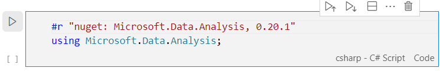

# Riassunto della call

Abbiamo ripercorso velocemente i temi della settimana:
 - Caricamento del dataset e manipolazione dei dati;
 - Visualizzare il dataset per riconoscere le feature migliori;
 - Evitare l'*overfitting* splittando il dataset per train e test;
 - Porting in notebook C# degli esempi Python forniti da Google.

## Lavorare con i dati
Gli algoritmi di machine learning lavorano prevalentemente con vettori. Abbiamo imparato ad usare varie librerie per le operazioni sui vettori.

### NumPy (Python)
È una libreria che offre molti metodi di utility. Ad esempio permette di creare vettori inizializzandoli con valori a caso.

```python
# 6 valori interi nel range indicato
int_vector = numpy.random.randint(low=50, high=101, size=(6))
# 6 valori float tra 0 e 1
float_vector = numpy.random.random([6])

```

Inoltre permette di compiere operazioni membro a mebro sugli elementi di due vettori:
 ```python
 vector1 = [1, 2, 3]
 vector2 = [2, 3, 4]
 result = vector1 * vector2
 #result is [2, 6, 12]
 ```
 
 Un'altra operazione molto comune è il [dot product](https://numpy.org/doc/stable/reference/generated/numpy.dot.html), che consiste nel moltiplicare membro a membro gli elementi di un vettore (come visto nell'esempio qui sopra) e poi sommare tutti i valori del vettore risultante. Lo si usa per moltiplicare i pesi `w` ai valori delle feature `x` ed ottenere la previsione `y`.
 
 ```python
 weights = [1, 2, 3]
 features = [2, 3, 4]
 bias = 5
 prediction = numpy.dot(weights, features) + bias
 #prediction vale (1*2) + (2*3) + (3*4) + 5 = 25
 ```
 
 NumPy offre anche una funzionalità di [broadcasting](https://numpy.org/doc/stable/user/basics.broadcasting.html), cioè se i due vettori coinvolti nell'operazione non dovessero avere la stessa lunghezza, il più corto viene prima allungato alla dimensione dell'altro, riempiendo con zeri.

 Se uno dei due operandi è un valore scalare, viene prima convertito in vettore.
 ```python
 input = [1, 2, 3]
 result = input + 10
 # result is [11, 12, 13]
 ```
 
 In questo caso, il valore `10` viene prima trasformato in un vettore della stessa lunghezza di `input` in cui ogni ogni valore è `10`, e poi viene fatta la somma membro a membro.
 
### Pandas (Python)

È una libreria che permette di lavorare con *dataset*, ovvero tabelle di dati in cui ogni colonna è rappresentata da un nome e dal relativo vettore di valori.

Permette di creare un dataset da zero ma l'uso più tipico è quello di caricare i dati da un file CSV.

```python
dataframe = pd.read_csv(filepath_or_buffer="dataset.csv")
```

Se il CSV contiene intestazioni, quelle diventeranno i nomi delle colonne nel DataFrame. I valori delle colonne possono essere manipolati esattamente come i vettori con NumPy.

```python
# Creo una nuova colonna in base al valore di un'altra
dataframe["rooms_per_person"] = dataframe["total_rooms"] / dataframe["population"]
```

I DataFrame hanno un metodo `describe` che offre statistiche sui dati contenuti all'interno (valori minimi e massimi, media, deviazione standard). 

```python
dataframe.describe()
```


Questo ci permette di esaminare il dataset per capire se ci sono valori anomali che dovremo poi eliminare o correggere.

La precisione del modello di ML dipenderà molto dalla qualità dei dati con cui l'avremo addestrato.

### Microsoft.Data.Analysis (.NET)

I DataFrame li troviamo anche nel [pacchetto NuGet Microsoft.Data.Analysis](https://www.nuget.org/packages/Microsoft.Data.Analysis/) e si comportano in maniera molto simile ai DataFrame di Pandas. Anche qui possiamo crearli da un file CSV.

```csharp
DataFrame data = DataFrame.LoadCsv("california_housing.csv", dataTypes: types);
```

E poi manipolare i dati, ad esempio aggiungendo una nuova colonna calcolata.

```csharp
data["people_per_bedroom"] = data["population"] / data["total_bedrooms"];
data.Description()
```

Il metodo `Description` mostrerà le statistiche del DataFrame esattamente come in Pandas.

> Gli esempi completi si trovano nel notebook [dataset.dib](dataset.dib) presente in questa cartella.


## Analisi dei dati con .NET
Per .NET esistono i cosiddetti "Polyglot notebooks", un equivalente dei Python Notebook che vengono usati per l'apprendimento di Machine Learning e delle tecnologie legate al Python in generale.

> I polyglot notebooks si possono installare come estensione di Visual Studio Code dal marketplace: [https://marketplace.visualstudio.com/items?itemName=ms-dotnettools.dotnet-interactive-vscode](https://marketplace.visualstudio.com/items?itemName=ms-dotnettools.dotnet-interactive-vscode)

Dopo aver installato l'estensione, premere `F1` in Visual Studio Code e digitare "notebook" per far apparire il comando "Polyglot notebook: create new blank notebook.


In un notebook si possono creare "celle di codice" e "celle markdown" per inframezzare il codice con spiegazioni.

Le celle di codice possono essere eseguite con l'apposito tasto play posto di lato.



Si possono referenziare anche pacchetti. Nella pagina NuGet del pacchetto, nella tab "Script & Interactive" è indicata la sintassi specifica da usare.


## Visualizzare i dati
Nei notebook (sia Python che .NET) si possono anche visualizzare output complessi e interattivi. Ad esempio, le librerie `mathplotlib` (Python) e `XPlot.Plotly` (.NET) possono creare grafici che ci aiutano a capire la correlazione tra le varie feature e le label.

In questo caso si vede che c'è una certa correlazione tra alcune latitudini (San Diego e Los Angeles) e il valore di una casa.


> Vedi l'esempio completo [dataset.dib](dataset.dib)

### Matrice di correlazione

Il [Pearson Correlation Coefficient](https://en.wikipedia.org/wiki/Pearson_correlation_coefficient) è un algoritmo che indica quando due misure siano correlate fra loro. Possiamo usarlo per realizzare una matrice e avere ben evidente quali siano le feature che influenzano maggiormente le label.

Le zone rosse sono quelle con maggior correlazione, mentre invece quelle blu rappresentano una correlazione inversa (più cresce una misura, più l'altra diminuisce).


> Con il pacchetto `MathNet.Numerics.Statistics` possiamo ottenere la matrice di correlazione fornendo il dataset. C'è un esempio completo in [dataset.dib](dataset.dib)

## Dataset split

Per addestrare un modello, è spesso necessario fare varie correzioni agli iperparametri, ad esempio:

- modificare il learning rate in modo che il gradient descent converga più velocemente;
- modificare il numero di elementi nel mini batch;
- decidere come inizializzare i pesi e il bias (zero o casuale).

Queste decisioni vengono influenzate dagli specifici dati che abbiamo nel dataset. Se usiamo l'intero dataset, rischiamo che il modello si adatti troppo fedelmente ai dati che abbiamo, al punto che poi non sarà in grado di fare previsioni accurate quando gli daremo dati mai visti prima.

Un modello troppo complesso (cioè con equazioni di grado elevato che producono "molte curve") di solito non è in grado di generalizzare bene il problema. È un problema chiamato *overfitting*.


Si preferisce invece spezzare il dataset in due parti (es. 80/20):
- Il **training set** lo useremo per addestrare il modello;
- Il **test set** lo useremo solo alla fine per valutare la precisione del modello.

Eventualmente si può ricavare anche un terzo set, il **validation set** che usiamo dopo il training per decidere come modificare gli iperparametri affinché possa essere addestrato meglio.

Il **test set** va comunque usato per ultimo: se il modello non dovesse essere di precisione soddisfacente, non ci rimane che raccogliere nuovi dati o migliorare il dataset esistente.

## Quanto deve essere preciso un modello?

Dipende dalla situazione in cui andiamo ad usarlo. Un modello poco preciso (es. [RSquared](https://it.wikipedia.org/wiki/Coefficiente_di_determinazione)=0.6) in genere non è utile perché fa previsioni leggermente migliori del tirare a caso. 

Dovremmo migliorare il dataset e il modello finché non comincia a dare risultati soddisfacenti. Per giudicare se è "soddisfacente", possiamo:

- chiedere un parere ai nostri utenti;
- valutare se ci fa ottenere una riduzione dei costi di esercizio;
- valutare se ci rende più competitivi sul mercato.