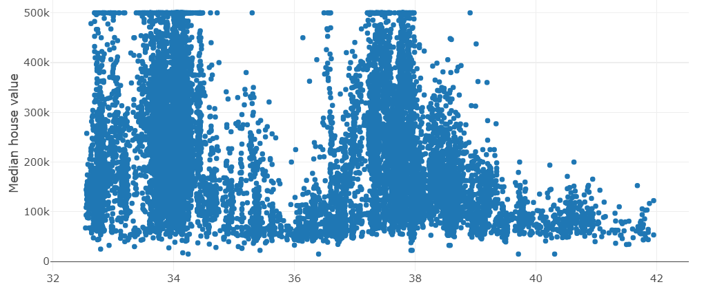

# Riassunto della call

Abbiamo ripercorso velocemente i temi della settimana:
 - Discretizzazione;
 - One-hot encoding;
 - Feature cross;
 - Pulizia del dataset.

## Discretizzazione
Alcune feature come latitudine e longitudine sono valori continui che però non influenzano linearmente la relativa label. Ad esempio, non è che aumentando la latitudine aumenta anche il valore di una casa.

Esaminando il dataset, abbiamo visto visto che ad alcune latitudini i valori (es. 34° e 38°) delle case variano molto, mentre invece ad altre latitudini (36° e 40°) sono piuttosto stabili.



La variabilità dipende dal tipo di territorio che troviamo a quella latitudine: se ci sono sia grandi città che deserti, allora ecco che avremo valori molto variabili.

Questa variabilità non aiuta affatto il modello ad apprendere. Anziché valori continui, dovremo quindi ricavare **valori discreti**, ad esempio facendo un arrotondamento.

```csharp
dataFrame["discretized_latitude"] = dataFrame["latitude"].Round();
dataFrame["discretized_longitude"] = dataFrame["longitude"].Round();
```

In questo modo, molte righe del dataset condivideranno lo stesso valore.

È già un miglioramento, anche se... arrotondare in quel modo la latitudine potrebbe comportare una grossa perdita di risoluzione. Infatti, in 1 grado di latitudine puoi trovare sia città che deserti. Conviene dunque moltiplicare il valore per 2 o 3 prima di arrotondare, così da riguadagnare un po' di risoluzione.

```csharp
dataFrame["discretized_latitude"] = (dataFrame["latitude"] * 3).Round();
dataFrame["discretized_longitude"] = (dataFrame["longitude"] * 3).Round();
```

In questo modo, ogni grado di latitudine e longitudine sarà diviso in 3, così che sia più probabile riuscire ad approssimare il territorio in categorie specifiche.


## One-hot encoding

Al momento abbiamo un dataset come il seguente:

|Indice|Lat. discretizzata|Lon. discretizzata|Valore|
|--|--|--|--|
|0|120|300|350.000|
|1|130|300|250.000|
|2|120|280|100.000|
|3|140|300|400.000|

I valori discretizzati possono essere ulteriormente lavorati in modo che siano più usabili da un modello. Prima ci facciamo un elenco dei valori unici trovati nel dataset per latitudine e longitudine:

```
Latitudine: 120, 130, 140
Longitudine: 280, 300
```

E poi torniamo nel dataset e rappresentiamo ogni latitudine e longitudine come un vettore sparso, cioè contenente un solo 1 e tutti gli altri 0. Il vettore ha come lunghezza il numero di valori unici. Ad esempio, per la latitudine avremo un vettore di 3 elementi, dato che 3 erano i valori unici trovati nel dataset.

Si chiama **one-hot encoding**.

|Indice|Lat. discretizzata|Lat. one-hot|Lon. discretizzata|Lon. one-hot|Valore|
|--|--|--|--|--|--|
|0|120|[1,0,0]|300|[0,1]|350.000|
|1|130|[0,1,0]|300|[0,1]|250.000|
|2|120|[1,0,0]|280|[1,0]|100.000|
|3|140|[0,0,1]|300|[0,1]|400.000|

In pratica, il valore di latitudine 130 lo rappresenteremo come [0, 1, 0], perché 130 è secondo nel nostro elenco di valori unici.

Il modello sarà libero di usare pesi diversi per ciascuno dei valori trovati nel vettore. Gli zeri annulleranno il prodotto con il peso e perciò non influiranno nella previsione del valore delle casa. Solo il valore che ha un 1 verrà di fatto preso in considerazione.

> Vedi l'esempio [one-hot-encoding.dib](one-hot-encoding.dib) di ML.NET

Grazie alla one-hot encoding di latitudine e longitudine, il modello produrrà previsioni più affidabili.

## Feature cross

Latitudine e longitudine, anche se discretizzate, non sono ancora utili al modello se prese singolarmente. Infatti, ad un valore di latitudine corrispondono molte longitudini diverse. Dobbiamo fare in modo che ogni riga del dataset sia associata ad un valore che rappresenti contemporaneamente sia latitudine che longitudine.

Possiamo quindi creare una nuova feature frutto dell'incrocio tra latitudine e longitudine. Una **feature-cross**, appunto.

Incrociare due vettori one-hot consiste nel creare un nuovo vettore, la cui lunghezza sarà il prodotto delle due lunghezze. Conterrà un solo 1, risultante dall'incrocio degli 1 dei due vettori originali.

Se latitudine `[0, 1, 0]` e longitudine `[1, 0]`, il risultato sarà un vettore di 6 elementi `[0, 1, 0, 0, 0, 0]`.

L'affidabilità del modello crescerà ulteriormente grazie alla feature cross dei vettori one-hot encoded.

## Pulizia del dataset
Dobbiamo ricordare che nel dataset possono esserci valori "strani", frutto magari di errori nell'inserimento dei dati. Possiamo identificare questi cosiddetti "outliers" visualizzando il dataset.


In questo caso, dovremmo rimuovere le righe con valori troppo lontani dal caso normale.