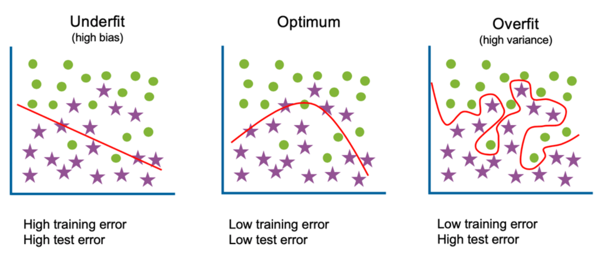
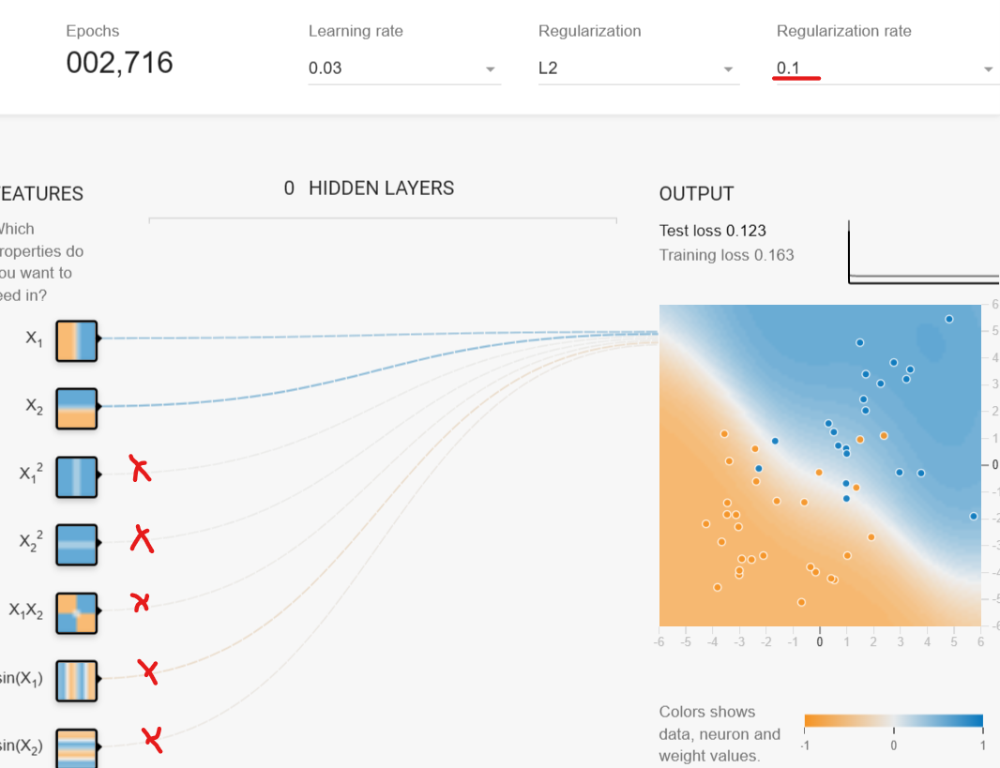

# Riassunto della call

Abbiamo parlato un po' di overfitting e di come prevenirlo usando la L<sub>2</sub> regularization.

## Il problema dell'overfitting

Quando un modello è complesso, cioè quando include vari [feature cross](../2023-10-20/README.md#feature-cross) tra 2 o più feature, è più probabile che incorra in overfitting.

Infatti, la funzione di un modello complesso contiene termini di grado elevato come quadrati, cubi o feature ottenute moltiplicandone altre tra loro. Questo permette alla curva di "snodarsi" repentinamente, soprattutto se i pesi _ω_ sono cresciuti parecchio durante l'addestramento.



Un modello overfit si adatta troppo precisamente ai dati di training, a tal punto che poi non riesce a fare previsioni affidabili con dati che non ha mai visto prima (cioè non riesce a _generalizzare_ bene).

Esiste anche il problema opposto: l'underfit. Se il modello è troppo semplice (contiene poche feature e nessun [feature cross](../2023-10-20/README.md#feature-cross)), non sarà in grado di seguire bene l'andamento dei dati.

È nostro compito riuscire a trovare il bilanciamento ottimale e abbiamo visto che ci sono varie tecniche:

- Fare [split del dataset](../2023-10-11/README.md#dataset-split) su tre insiemi: train, test e validation, così che possiamo verificare se il modello riesce a generalizzare bene. In alternativa possiamo fare cross-validation per addestrare un certo numero di modelli e scegliere il migliore;

- Terminare l'addestramento del modello dopo un certo numero di iterazioni, così che i pesi _ω_ non crescano troppo;

- Usare la L<sub>2</sub> regularization che penalizza i modelli con pesi _ω_ troppo grandi.

> Nota: per "troppo grande" si intende un valore positivo molto elevato ma anche un valore negativo molto basso.

## L<sub>2</sub> regularization

È un termine che viene sommato alla [loss](../2023-09-29/README.md#calcolare-e-ridurre-il-costo).

- La loss (Mean square error) è la media dei quadrati degli errori;
- La L2 regularization è la somma dei quadrati dei pesi _ω_.

```
Loss + L2 Regularization
```
Il nostro obiettivo è minimizzare questa somma, iterazione dopo iterazione durante l'addestramento del modello.

È probabile che la L<sub>2</sub> regularization abbia un valore molto molto grande, perciò è bene che venga ridotta altrimenti renderebbe insignificante il loss.

Perciò la moltiplichiamo per un valore **λ** molto piccolo, in modo da ridurne l'effetto.

```
Loss + (λ * L2 Regularization)
```

L'iperparametro λ è un po' come il learning rate: bisogna sperimentare un po' per capire che valore funziona meglio.

## Come λ influenza l'apprendimento del modello

Se λ è troppo grande, inibirà l'efficacia del modello: i pesi _ω_ di alcune feature, diventeranno quasi 0 (ma non esattamente 0) e quindi è quasi come non aver usato affatto quelle feature.

Se λ è troppo piccolo, è quasi come non aver usato affatto la L<sub>2</sub> regularization.

Se λ è stato scelto correttamente, smorzerà la crescita indiscriminata dei pesi _ω_, quindi impedendo alla curva di snodarsi repentinamente.

Con ML.NET, il valore di λ può essere fornito ai trainer del modello, come in questo esempio:
```csharp
IEstimator<ITransformer> sdcaEstimator = context.Regression.Trainers.Sdca(
    featureColumnName: "features",
    labelColumnName: "median_house_value",
    l2Regularization: 0.0001f);
```

# Come λ influenza i pesi _ω_ di feature non informative

Una feature è non-informativa quando non influenza la previsione. Ad esempio, il fatto che una persona sia destrorsa o mancina non influenza il valore della sua casa.

Se si sceglie un λ adeguato, i pesi delle feature non informative dovrebbero tendere a 0. Come si vede in questa immagine, le feature indicate dalla X sono quelle non informative e infatti hanno pesi molto piccoli (lo si capisce dallo spessore della linea).



Ricorda che puoi sapere quanto una feature sia informativa usando la [matrice di correlazione](../2023-10-11/README.md#matrice-di-correlazione).

