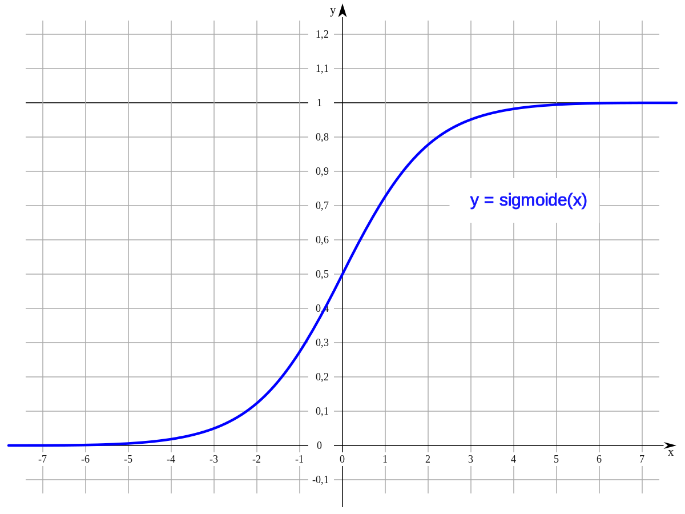
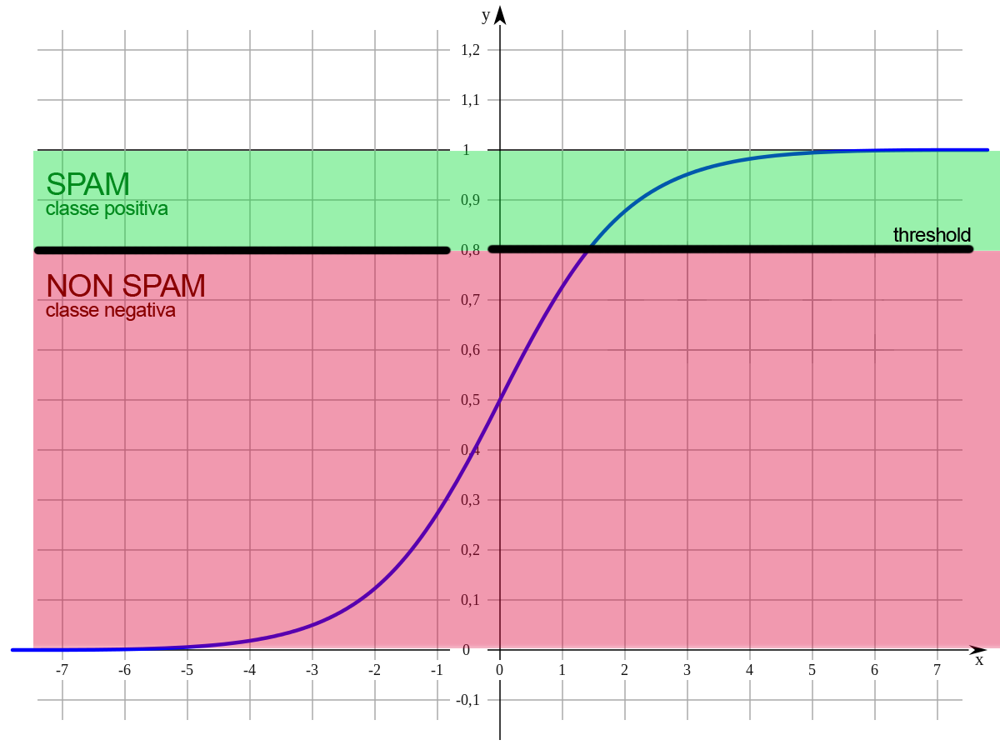

# Regressione logistica / classificazione

La regressione logistica è il metodo da usare quando vogliamo ottenere delle previsioni tipo "vero/falso". È di fatto un metodo di *classificazione binaria* perché prevede come output solo due possibili classi: una classe "positiva" e una classe "negativa".

Ad esempio, un modello in grado di classificare delle email come "spam" (la classe positiva) o "non spam" (la classe negativa) potrebbe usare la regressione logistica come metodo di apprendimento.

> In precedenza abbiamo visto anche la regressione lineare, il cui scopo era invece produrre un valore continuo, come il prezzo di vendita di una casa.

## Sigmoid

Il risultato della regressione logistica viene fornito alla funzione *sigmoid* che lo trasforma in un valore continuo compreso tra 0 e 1.

A fronte di questo valore, siamo noi a dover decidere se l'esempio appartenga alla classe positiva o alla classe negativa. Chiaramente, più il valore è vicino a 1, più saremo confidenti del fatto che appartenga alla classe positiva.

> Durante l'apprendimento del modello viene usata una funzione di costo chiamata [LogLoss](https://developers.google.com/machine-learning/glossary#Log_Loss), che è differente dalla Mean Square Error (MSE) usata in regressione lineare.

## Threshold

La prima idea che ci potrebbe venire in mente è quella di associare alla classe positiva tutti i valori >= 0.5. In realtà non è sempre il caso di fare così perché un valore di 0.55 potremmo benissimo essere un falso positivo.

In alcune situazioni potrebbe essere un problemone avere dei falsi positivi. Ad esempio, se un'email importante venisse erroneamente classificata come "spam" (la classe positiva), l'utente rischierebbe non leggerla mai e questo potrebbe avere importanti ripercussioni.

Meglio allora **ridurre il rischio di avere dei falsi positivi** e alzare la soglia (_threshold_) da 0.5 a 0.8, o altro valore che reputiamo opportuno. In questo modo, se battezziamo come spam solo i valori >= 0.8, ridurremo la probabilità di avere falsi positivi.

Alzando la threshold, aumenteranno di certo i falsi negativi (email di spam che vengono classificate come non-spam) ma, in questo caso specifico, un falso negativo è certamente meno problematico di un falso positivo. Infatti, se l'utente si trova un'email di spam nella sua posta in arrivo avrà tutt'al più un fastidio di poco conto.

## Metriche di qualità

Dato che possiamo spostare il threshold a piacimento, potrebbero esistere dei casi in cui ha senso porlo su 0.99 anziché 0.8. Ad esempio, quando stiamo realizzando un modello per la previsione di **eventi rari o molto rari**.

In questa situazione è importante scegliere le metriche giuste per determinare se il nostro modello è abbastanza affidabile.

### Precision

