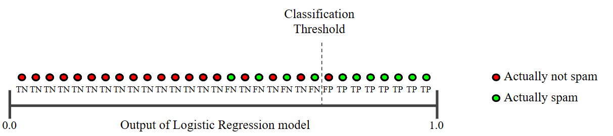

# Regressione logistica / classificazione

La regressione logistica è il metodo da usare quando vogliamo ottenere delle previsioni tipo "vero/falso". È di fatto un metodo di *classificazione binaria* perché prevede come output solo due possibili classi: una classe "positiva" e una classe "negativa".

Ad esempio, un modello in grado di classificare delle email come "spam" (la classe positiva) o "non spam" (la classe negativa) potrebbe usare la regressione logistica come metodo di apprendimento.

> In precedenza abbiamo visto anche la regressione lineare, il cui scopo era invece produrre un valore continuo, come il prezzo di vendita di una casa.

## Sigmoid

Il risultato della regressione logistica viene fornito alla funzione *sigmoid* che lo trasforma in un valore continuo compreso tra 0 e 1.


A fronte di questo valore, siamo noi a dover decidere se l'esempio appartenga alla classe positiva o alla classe negativa. Chiaramente, più il valore è vicino a 1, più saremo confidenti del fatto che appartenga alla classe positiva.

La funzione sigmoid è definita così in javascript:
```
function sigmoid(x) {
  return 1 / (1 + Math.exp(-x));
};
```


> Durante l'apprendimento del modello viene usata una funzione di costo chiamata [LogLoss](https://developers.google.com/machine-learning/glossary#Log_Loss), che è differente dalla Mean Square Error (MSE) usata in regressione lineare.

## Threshold

La prima idea che ci potrebbe venire in mente è quella di associare alla classe positiva tutti i valori >= 0.5. In realtà non è sempre il caso di fare così perché un valore di 0.55 potremmo benissimo essere un falso positivo.

In alcune situazioni potrebbe essere un problemone avere dei falsi positivi. Ad esempio, se un'email importante venisse erroneamente classificata come "spam" (la classe positiva), l'utente rischierebbe non leggerla mai e questo potrebbe avere importanti ripercussioni.

Meglio allora **ridurre il rischio di avere dei falsi positivi** e alzare la soglia (_threshold_) da 0.5 a 0.8, o altro valore che reputiamo opportuno. In questo modo, se battezziamo come spam solo i valori >= 0.8, ridurremo la probabilità di avere falsi positivi.


Alzando la threshold, aumenteranno di certo i falsi negativi (email di spam che vengono classificate come non-spam) ma, in questo caso specifico, un falso negativo è certamente meno problematico di un falso positivo. Infatti, se l'utente si trova un'email di spam nella sua posta in arrivo avrà tutt'al più un fastidio di poco conto.

## Metriche di qualità

Dato che possiamo spostare il threshold a piacimento, potrebbero esistere dei casi in cui ha senso porlo su 0.99 anziché 0.8. Ad esempio, quando stiamo realizzando un modello per la previsione di **eventi rari o molto rari**.


In questa situazione è importante saper scegliere le metriche giuste per determinare se il nostro modello è abbastanza affidabile o no.

### Accuracy
La accuracy si calcola così:
```
numero di previsioni corrette
⎯⎯⎯⎯⎯⎯⎯⎯⎯⎯⎯⎯⎯⎯⎯⎯⎯⎯⎯⎯⎯⎯⎯⎯⎯⎯⎯⎯⎯⎯
 numero totale di previsioni
```

cioè
```
     VP + VN
⎯⎯⎯⎯⎯⎯⎯⎯⎯⎯⎯⎯⎯⎯⎯⎯⎯⎯
VP + FP + VN + FN
```

Dove:
 - **VP**: veri positivi (cioè positivi previsti correttamente)
 - **FP**: falsi positivi (cioè un negativo incorrettamente classificato come positivo)
 - **VN**: veri negativi (cioè negativi previsti correttamente)
 - **FN**: falsi negativi (cioè un positivo incorrettamente classificato come negativo)

Quando stiamo realizzando un modello che deve predire eventi rari, ad esempio con threshold >= 0.99, la accuracy può trarci in inganno. Infatti, se il nostro modello è talmente pessimo che predice sempre "negativo", avrà comunque un'accuracy del 99%.

In questi casi dobbiamo quindi tenere in considerazione altre metriche.

## Precision e recall

La **precision** tiene in considerazione i falsi positivi e si calcola come segue:

```
  VP
⎯⎯⎯⎯⎯⎯⎯
VP + FP
```

Nel caso precedente, di un modello talmente pessimo che predice sempre "negativo", la precision non sarà calcolabile perché abbiamo 0 al denominatore.
```
  0
⎯⎯⎯⎯⎯ = N/A
0 + 0
```

Andiamo allora a considerare l'altra metà della mela, che è la **recall**, che invece tiene conto dei falsi negativi:

```
  VP
⎯⎯⎯⎯⎯⎯⎯
VP + FN
```

Nel caso di un modello che predice sempre "negativo", avremo una recall uguale a 0, che ci lascia intendere che non abbiamo fatto un buon lavoro.

```
  0
⎯⎯⎯⎯⎯ = 0
0 + 1
```

Di solito precision e recall fanno un tiro alla fune: quando l'una aumenta, l'altra diminuisce e viceversa. Dipende molto anche dal punto in cui tracciamo la threshold. Più aumenta, più aumenteranno i falsi negativi e più diminuiranno i falsi positivi.



Dobbiamo quindi tenere in considerazione entambe, sia precision che recall, per avere un quadro più chiaro. Teniamo sempre a mente che di progetto in progetto cambia la criticità dell'avere falsi positivi e falsi negativi.

## Confusion matrix
È un modo di rappresentare VP, FP, VN e FN in una tabella, in modo da averli sempre ben chiari.


> Strumenti come ML.NET possono stampare la confusion matrix.

Si usa anche per la classificazione multi-classe. In questo caso non avremo solo due classi "positivo" o "negativo" ma ne avremo *n*. La confusion matrix apparirà come segue.


Dobbiamo prestare particolare attenzione ai riquadri di colore intenso che cadono fuori dalla diagonale, perché quelli saranno esempi classificati incorrettamente.

## ROC
Se siamo indecisi su quale sia il miglior threshold da usare (perché abbiamo detto che influenza il numero di falsi positivi e falsi negativi), possiamo disegnare un grafico e farci un'idea.

Il ROC (Receiver Operating Characteristic) è una curva che si ottiene considerando tutti i threshold possibili e misurando per ciascuno i **veri positivi** e i **falsi positivi**.

I veri positivi sono rappresentati lungo l'asse *y*, mentre i falsi positivi lungo l'asse *x*. 


La curva blu rappresenta un modello migliore perché ci sono dei threshold per cui i veri positivi sono molti e i falsi positivi pochi.


Idealmente, dovremo cercare di migliorare il modello in modo che l'area sottesa dalla curva aumenti il più possibile (si chiama AUC - Area under curve) perché questo implicherà che avremo molti veri positivi e pochi falsi positivi.